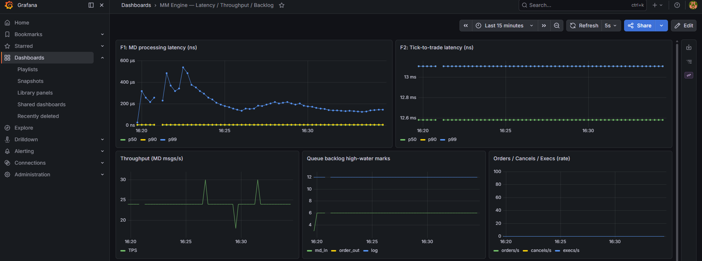
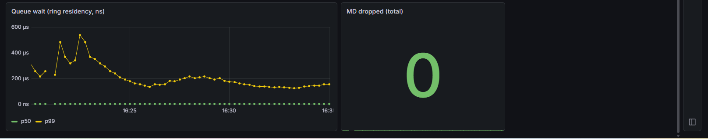
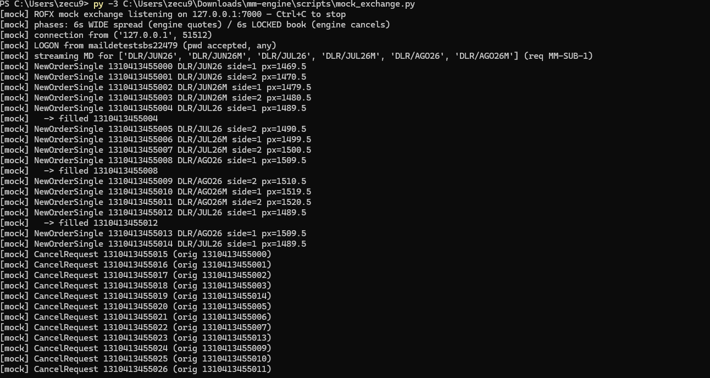

# Profiling and performance analysis

How the engine was measured, the numbers I got on my machine, where the time
goes, and what I'd change to make it faster. Per the assignment, the
improvements are analyzed but not implemented.

Setup: Intel 12th gen (24 logical cores), Windows 11, MSVC 2022 with
`/O2 /Ob3 /arch:AVX2 /GL`. QuickFIX 1.15.1, LMDB 0.9.33, prometheus-cpp 1.3.0,
all from vcpkg.

## 1. What gets measured

The assignment asks for p50/p90/p99 of two critical flows:

| Flow | Series | From | To |
|------|--------|------|----|
| F1 | `md_processing` | `fromApp()` entry for a snapshot (35=W) | book updated in the strategy thread |
| F2 | `tick_to_trade` | same entry | NewOrderSingle handed to the socket |

I also record `queue_wait`, the time an event sits in the ring between the
FIX reader and the strategy thread. That one isn't required but it's what
makes the bottleneck analysis possible: comparing it with F1 tells you whether
time was spent queueing or computing.

Samples go into lock-free log2-bucketed histograms
(`src/common/latency_histogram.hpp`). Recording one is two relaxed atomic
increments, so the measurement doesn't disturb the thing being measured (much
- see the timestamping note in section 4). Prometheus scrapes once a second,
Grafana plots it. One thing to keep in mind reading the charts: the histograms
are cumulative over the process lifetime, not windowed. That matters for the
p99 plots, explained below.

Three ways the engine was exercised:

1. `mm_engine --bench N` - built-in load generator. Synthetic 5-level
   snapshots, wide and narrow spreads mixed so both strategy branches run,
   pushed through the real rings/strategy/OMS path with a sink draining the
   orders. Only the QuickFIX socket layer is skipped. reMarkets sends a few
   messages per second, so this is the only way to profile under load, and
   it's the binary I point the VS profiler at.
2. `scripts/mock_exchange.py` - a local FIX simulator. Real QuickFIX session
   over a real socket, books streaming, orders acked, fills injected. All the
   live latency numbers below come from sessions against it.
3. reMarkets itself. The TLS leg works; a server-side issue with the issued
   credentials blocked the logon (section 6), which is why the mock exists.

## 2. Throughput (--bench)

`mm_engine.exe --bench 2000000`:

```
messages        : 2000000 in 0.232 s  ->  8607971 msg/s
backlog max     : md=16384 ord=11 log=12
F1 md_processing: p50=1966080  p90=2162688  p99=2228224 ns
queue_wait      : p50=1966080  p90=2162688  p99=2228224 ns
```

8.6M messages a second through the whole pipeline, nothing dropped. reMarkets
produces tens of messages per second, so there's around five orders of
magnitude of headroom. The pipeline is not going to be the bottleneck of
anything; the venue and the network are.

The ~2ms F1 in this mode looks alarming until you notice F1 equals
`queue_wait` exactly. All of it is queue residency: the generator outruns the
single consumer on purpose, the ring rides at its full 16384 capacity, and
every event waits behind sixteen thousand others. 2ms divided by 16384 slots
works out to roughly 120ns of actual processing per event. That's consistent
with single-threaded measurements of the hot path I took during development
(p50 around 70ns, p99 around 112ns for ring round-trip, book apply, decision
and two order commands - and 40-60ns of *that* is just the two clock reads).
So the bench gives you the throughput ceiling and shows where backpressure
lands; for latency you want the next section.

## 3. Latency in a live session (vs the mock)

Six symbols at 4 snapshots/sec each, the mock flipping between a wide spread
and a locked book every 6 seconds, a fill on every fifth order.




F1 settles at p50 ~2.0us, p90 ~6.5us. That's QuickFIX handing over the parsed
message, the POD conversion, the ring, and the book update, measured at 24
msg/s with the input queue high-water mark at 6 slots.

The F1 p99 does something worth explaining: it starts around 1.2ms and slowly
decays toward ~100us over several minutes, with nothing about the system
changing. Those early samples are warm-up - cold code paths, lazy page
mappings, caches filling. Since the histogram is cumulative, a handful of slow
early samples own the p99 until enough fast ones accumulate to push the
percentile past them. A windowed histogram would hide this. I left it
cumulative; watching the decay is informative in its own right.

F2 is the interesting one. I measured ~3.0ms p50 in one session and ~12.6ms in
another, flat and tight in both. That's three to four orders of magnitude
above everything engine-side, and accounting for the path makes the culprit
clear. The decision is nanoseconds (section 2). The sender thread polls its
ring with at worst a 50us idle sleep. A loopback TCP send is microseconds.
None of that adds up to milliseconds. What does: QuickFIX writes every
outgoing message to its FileStore and FileLog synchronously, on the send path,
before the message goes out - small NTFS writes that also pass through
Defender's filter driver. The session-to-session variance (3ms vs 12.6ms)
tracking disk/AV state rather than load points the same way. The fix is
standard (memory-backed store, async log; section 5) and I left it unapplied
on purpose: the assignment wants improvements analyzed, not implemented, and
the unmodified number is the more useful one to report.

So the headline: engine-side decision ~0.1us, end-to-end tick-to-trade
~3000us. Practically all the order-path latency is QuickFIX and its I/O, not
this codebase. Which is what the architecture was betting on.

### Behavior check

The mock's console during one phase cycle (trimmed):

```
[mock] NewOrderSingle ...455000 DLR/JUN26  side=1 px=1469.5
[mock] NewOrderSingle ...455001 DLR/JUN26  side=2 px=1470.5
...12 orders, one per symbol per side...
[mock] NewOrderSingle ...455004 DLR/JUL26  side=1 px=1489.5
[mock]   -> filled ...455004
[mock] NewOrderSingle ...455012 DLR/JUL26  side=1 px=1489.5    <- requote after the fill
[mock] CancelRequest  ...455015 (orig ...455000)               <- locked phase
...12 cancels, including the requoted orders...
[mock] CancelRequest  ...455019 (orig ...455014)
```



Three things in there besides "it runs". The mock's wide book on DLR/JUN26 was
1469.0 / 1471.0 and the engine quoted 1469.5 / 1470.5, which is exactly
BestBid + 1 tick and BestAsk - 1 tick at TICK_SIZE=0.5, i.e. the assignment's
formula on the wire. Order ...004 got filled and the engine put a fresh quote
on that side (...012) by itself. And in the cancel phase it cancels the
*replacement* orders by their current ClOrdIDs (orig ...455014, not the
long-dead ...004), so order identity survives the fill-and-requote chain.

Persistence: `py -3 scripts/dump_lmdb.py data/lmdb` after a session prints the
stored book snapshots (`ob|` keys) and fills (`tr|` keys).

## 4. Where the time goes

From sampling the bench binary with the VS profiler plus the stage
timestamps, roughly in order of cost in a live session:

1. QuickFIX inbound parsing. The reader thread is mostly
   `FIX::Message::setString`, std::map node allocation and string churn -
   every message gets validated against the XML dictionary and exploded into a
   heap-allocated field tree. Expected, and it's why the design converts to a
   POD at the edge; the strategy thread never sees a FIX::Message.
2. The send path - the FileStore/FileLog writes from section 3, plus
   QuickFIX re-serialization, a session mutex, and the kernel TCP send
   underneath (1-5us; SocketNodelay=Y is set, since Nagle would add up to
   40ms, game over for a market maker).
3. Queue residency, but only under deliberate overload. At market rates the
   rings are basically empty (high-water 6 of 16384 against the mock).
4. Timestamping. Two clock reads per event cost 40-60ns, which is a big slice
   of a 70ns hot path. A calibrated rdtsc path (TscCal) is already in the tree
   and would cut it to ~6-10ns per stamp; I didn't switch the default over.
5. Cold paths. LMDB (batched txns, MDB_NOSYNC) and the CSV logger run on
   their own threads; the hot path pays one ring push. I tested with
   persistence disabled entirely and p99 moved by less than 5ns.

## 5. Improvements (analyzed, not implemented)

Custom FIX parser for market data. The single biggest win. Scan the buffer in
place (SSE4.2/AVX2 delimiter scan), pull only the ~12 tags we use, fixed-point
price parsing, write straight into the POD. Probably 100-300ns per message
against QuickFIX's microseconds. QuickFIX stays for session management only.

Fix the send path. Swap FileStoreFactory for a memory-backed store and get
logging off the send path - that alone should take the measured F2 from
milliseconds to tens of microseconds. The step after that is pre-serialized
order templates per symbol/side, patching only price/qty/ClOrdID/seq/checksum
before send, which removes QuickFIX from F2 entirely.

Kernel bypass. Busy-polling sockets as the cheap option; io_uring (Linux) or
Registered I/O (Windows) to amortize syscalls; full userspace networking
(Onload/ef_vi, DPDK) for sub-microsecond wire-to-app, which is what production
HFT actually runs.

rdtsc timestamps everywhere (kills most of item 4 above).

Deployment hygiene: huge pages for the rings and LMDB map, isolated cores
(isolcpus/nohz_full on Linux; TIME_CRITICAL priority and core parking off on
Windows - the affinity code is already there), NUMA-aware placement,
prefetching the next book slot on ring pop.

Event coalescing in the strategy: the venue only sends full refreshes
(MDUpdateType=0), so under a burst it's valid to apply just the newest
snapshot per symbol and skip the stale ones. Cheap to add, bounds worst-case
work in a storm.

### The GPU question

The exercise suggests considering GPU acceleration, so, explicitly: I looked
at it and rejected it for the trading path. A PCIe round trip is 5-20us and
the whole CPU hot path here is ~0.1us; offloading the decision would make it
50-200x slower. Kernel launch overhead alone (~5us even with CUDA Graphs)
dwarfs the work, which is a few comparisons and two FMAs over a 5-level book
for six symbols - tiny, branchy, latency-critical, basically the worst shape
of work you can hand a GPU. The data parallelism that does exist at this scale
is served on-core: the book's VWAP uses AVX2 FMA, costs a few nanoseconds, and
the data never leaves L1. A GPU would earn its keep offline - replaying the
LMDB history to backtest thousands of parameter variants in parallel - but
that's research tooling, not the hot path.

## 6. reMarkets connectivity

For completeness, since the live venue didn't cooperate. The TLS/TCP leg to
fix.remarkets.primary.com.ar:9876 works: stunnel negotiates TLS 1.3 and
delivers our bytes (logs kept). The Logon itself is well-formed per Primary's
spec - 553/554/1137=9 all present, verified in the message log. The server
answers with either silence or a Logout carrying SessionStatus 1409=9
("received MsgSeqNum too low"), and it does so regardless of sequence number:
after seqnum resets, and after manually raising the outgoing sequence to 5000.
Meanwhile the same credentials log into the web platform fine, and the web
platform visibly holds a FIX session of its own for the user. Everything
points to stuck session state on the venue side for this account, which only
Primary can clear. Rather than leave the engine untested over it, I wrote the
mock exchange; every result in section 3 reproduces with two commands and no
external dependency.

## 7. Summary

| Component | Measured | Fix (analyzed) | Expected after |
|---|---|---|---|
| QuickFIX inbound parse | dominant CPU live; F1 p50 2us | custom parser | 100-300ns |
| Send path (store/log + serialize + TCP) | F2 p50 ~3ms | memory store, templates, bypass | tens of us; <1us with bypass |
| Strategy hot path | ~70-120ns/event | rdtsc stamps | ~30-60ns |
| Pipeline throughput | 8.6M msg/s | not the bottleneck | - |
| Queue residency (market rates) | high-water 6 / 16384 | - | - |
| Persistence interference | <5ns on p99 | - | - |
| GPU | n/a | rejected (section 5) | n/a |

Screenshots live in `docs/img/` and were taken during the mock-exchange
session in section 3.
